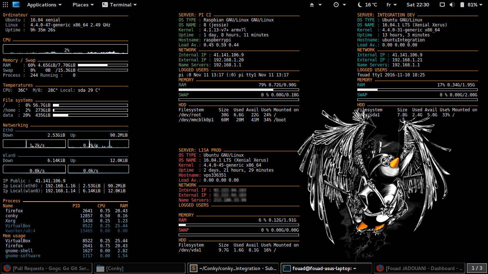

# [Bash] Monitor servers remotely using Conky
A small script and config to monitor remotely your servers using conky
# How it works
* You need to set up SSH Keys to identify your machine without involving password
* You need to change servers array in server_info.sh file lines 18 and 38
* You need to change the default ssh port in server_info.sh file line 84 from 2122 to 22(default port for ssh)
* Customize your conky config based on one of mine (conky_*)
* Execute it with
```
$ conky -d -q -c your_conky_config
```



##FAQ
* Q: Can i have more explanation about how does it work ?<br />
  A: a short article will be available on my [blog] http://blog.jfouad.com

* Q: Why did you use server_info.sh when you can execute command form conky config ?<br />
  A: Quite simply to avoid multiple request networks and keep logs

* Q: Why did you use monitor.sh when you can execute command from server_info.sh ?<br />
  A: Because I'm using monitor.sh from other programs

* Q: Why did you use bash ?<br />
  A: I'd have liked to use Python or Perl but sometimes I find myself in hostile terrain with limited resources
